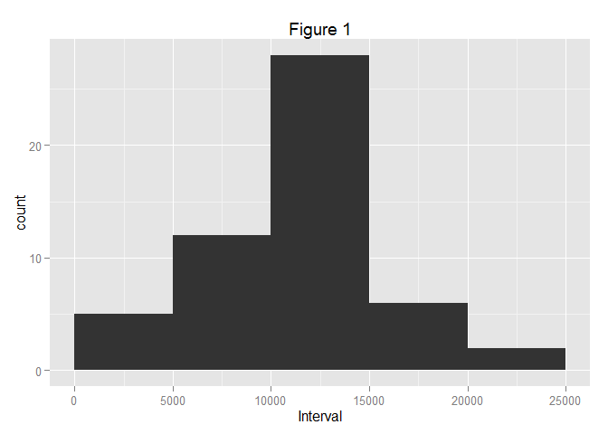
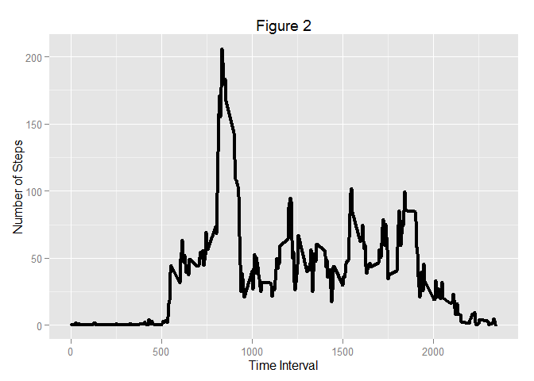
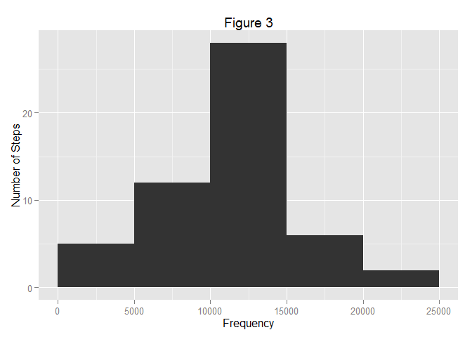
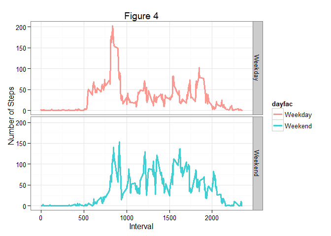

# Reproducible Research: Peer Assessment 1
##Loading the required packages

```r
require(dplyr)
require(ggplot2)
```

## Loading and preprocessing the data


```r
download.file("https://d396qusza40orc.cloudfront.net/repdata%2Fdata%2Factivity.zip",
              "tempfile")
data <- unzip("tempfile")
activity <- read.csv(data, stringsAsFactors = FALSE)
rm(data)
```

## What is mean total number of steps taken per day?


```r
actgrp <- group_by(activity, date)
totalsteps <- summarise(actgrp, sumsteps = sum(steps))
plot <- ggplot(totalsteps, aes(x = sumsteps))
plot + geom_histogram(breaks = c(0, 5000, 10000, 15000, 20000, 25000)) + 
        labs(x = "Number of Steps") + 
        labs(x = "Interval") + 
        labs(title = "Figure 1")
```

 

###Mean and Median calculation


```r
mean1 <- round(mean(totalsteps$sumsteps, na.rm = TRUE),2)
mean1
```

```
## [1] 10766.19
```

```r
median1 <- median(totalsteps$sumsteps, na.rm = TRUE)
median1
```

```
## [1] 10765
```
- Mean of imputed data set is 1.076619\times 10^{4}.  
- Median of imputed data set is 10765.  

## What is the average daily activity pattern?


```r
actgrp1 <- group_by(activity, interval)
totalsteps1 <- summarise(actgrp1, sumsteps = mean(steps, na.rm = TRUE))
plot <- ggplot(totalsteps1, aes(x = totalsteps1$interval, y = totalsteps1$sumsteps)) 
plot + geom_line(lwd = 1.5) + 
        labs(x = "Time Interval") + 
        labs(y = "Number of Steps") + 
        labs(title = "Figure 2")
```

 

* There is a peak around 800th interval

## Imputing missing values

- Total Missing values

```r
sum(!complete.cases(activity))
```

```
## [1] 2304
```

### Removing Missing Values


```r
for(i in 1: length(activity$steps)){
        if(is.na(activity[i,1])){
                d <- activity[i,2]
                mn <- median(activity[which(activity$date ==  d),1], 
                                           na.rm = TRUE)
                if(is.na(mn)){
                        activity[i,1] <- 0
                } else{
                        activity[i,1] <- mn
                }
        }
}
#Plotting the histogram after imputing missing values
totalsteps <- summarise(actgrp, sumsteps = sum(steps))
plot <- ggplot(totalsteps, aes(x = sumsteps))
plot + geom_histogram(breaks = c(0, 5000, 10000, 15000, 20000, 25000)) +
        labs(x = "Frequency") + 
        labs(y = "Number of Steps") + 
        labs(title = "Figure 3")
```

 

### Mean and median of total number of steps taken per day


```r
mean2 <- round(mean(totalsteps$sumsteps, na.rm = TRUE),2)
mean2
```

```
## [1] 10766.19
```

```r
median2 <- median(totalsteps$sumsteps, na.rm = TRUE)
median2
```

```
## [1] 10765
```
- Mean of imputed data set is 1.076619\times 10^{4}.  
- Median of imputed data set is 10765.
- These values are very close to the original values so this imputing strategy is not very effective for this dataset

## Are there differences in activity patterns between weekdays and weekends?


```r
#Manipulating dataset to identify weekdays and weekends
activity$date <- as.Date(activity$date)
activity <- mutate(activity, typeofday = weekdays(date)) %>% 
            mutate(dayfac = ifelse(typeofday %in% c("Saturday", "Sunday"),1,0))
activity$dayfac <- factor(activity$dayfac, 
                          levels = c(0, 1),
                          labels = c("Weekday", "Weekend"))
actgrp3 <- group_by(activity, interval, dayfac)
totalsteps3 <- summarise(actgrp3, sumsteps = mean(steps))
#Plotting the activity
plot <- ggplot(totalsteps3, aes(interval, sumsteps))
plot + geom_line(aes(color = dayfac), 
                 lwd = 1.1, 
                 alpha = 3/4) +
        facet_grid(dayfac ~ .) +
        labs(x = "Interval") + 
        labs(y = "Number of Steps") + 
        labs(title = "Figure 4") + 
        theme_bw()
```

 


